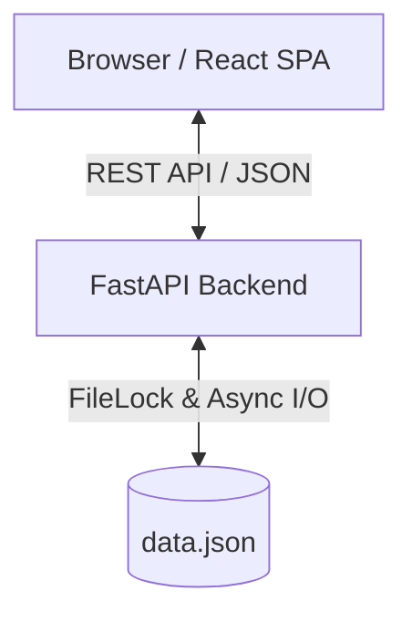

# Architecture

## System Overview

The Smart Expense Tracker is a decoupled full-stack application built using React (Frontend) and FastAPI (Backend). The application uses a local JSON file for data persistence, ensuring an extremely lightweight footprint while utilizing modern asynchronous I/O and file-locking to handle concurrency safely.



## Backend Architecture

The backend follows a classic 3-layer architecture to ensure clear separation of concerns, testability, and ease of maintenance:

1.  **Routers (Controllers)**: Handle incoming HTTP requests, validate input via Pydantic, and return appropriate HTTP responses and status codes.
2.  **Services**: Contain the core business logic. They process data, compute statistics, and mediate between the routers and the repository.
3.  **Repository (Data Access)**: Handles the raw reading and writing of data. In this app, it manages a `data.json` file using atomic writes and file locking mechanisms.

**Rationale**: This separation allows us to easily swap out the JSON persistence layer for a real database (like PostgreSQL) in the future without touching the business logic or API routing.

## Data Flow

1.  **Request**: Client sends a POST request to `/api/v1/expenses`.
2.  **Validation**: FastAPI uses Pydantic to validate the incoming payload (e.g., amount must be positive, currency valid).
3.  **Service Processing**: The router passes the validated data to the `ExpenseService`, which assigns an ID and timestamp.
4.  **Persistence**: The service calls the `JSONRepository`. The repository acquires a file lock, reads the current state, appends the new expense, and atomically writes the updated JSON back to disk.
5.  **Response**: The newly created expense object is returned to the client.

## Frontend Architecture

The frontend is a React 18 Single Page Application built with Vite and TypeScript.

-   **Component Hierarchy**: 
    -   `Layout`: Manages sidebar and header.
    -   `Pages`: Top-level views (Dashboard, Expenses, Settings).
    -   `Components`: Reusable UI elements (ExpenseCard, Chart, Modal).
-   **State Management**:
    -   **Server State**: Managed by **TanStack Query** (React Query). Handles data fetching, caching, synchronization, and optimistic updates.
    -   **UI State**: Managed by React Context and local state (e.g., ThemeContext for dark mode, filter selections).

## Data Model

The primary entity is the `Expense`. Stored as an array of objects in `data.json`:

```json
{
  "id": "uuid-v4-string",
  "title": "Grocery Shopping",
  "amount": 45.99,
  "currency": "USD",
  "category": "Food",
  "date": "2023-10-27T14:32:00Z",
  "notes": "Weekly groceries"
}
```

## Security

-   **Validation**: Strict input validation using Pydantic schemas.
-   **CORS**: Configured to only allow requests from specific frontend origins.
-   **Rate Limiting**: Applied via custom middleware to prevent abuse (e.g., max 100 requests per minute).
-   **Security Headers**: Added via FastAPI middleware in development and nginx in production.

## Design Decisions

-   **Why FastAPI?**: High performance, native async support, and auto-generated OpenAPI documentation.
-   **Why TanStack Query?**: Simplifies data fetching logic, completely eliminating the need for complex Redux boilerplate for server state.
-   **Why JSON with FileLock?**: Requirement specified a lightweight persistence layer. File locking ensures thread safety during concurrent requests.
-   **No ORM**: Since we are writing to a flat JSON file, introducing an ORM like SQLAlchemy would add unnecessary overhead.

## Scalability Considerations

If the application needed to scale to handle thousands of concurrent users:
1.  **Database**: Replace the JSON file repository with PostgreSQL.
2.  **Caching**: Introduce Redis to cache aggregate queries (like monthly statistics).
3.  **Horizontal Scaling**: Run multiple instances of the FastAPI backend behind a load balancer.
